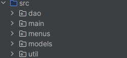

# 🏦 Sistema Bancário Simples em Java

Este projeto é uma simulação de um sistema bancário básico, desenvolvido em Java, que permite a gestão de clientes e as suas contas, incluindo operações de depósito, saque e visualização de extrato. O sistema também possui um módulo de gerente para cadastro e ativação de contas de clientes.

---

## 📐 Arquitetura do Projeto

O código-fonte está estruturado em pacotes seguindo um padrão de camadas para responsabilidades claras.

### Estrutura de Pacotes

Abaixo está a visão geral da organização de diretórios do projeto:



| Pacote | Responsabilidade |
| :--- | :--- |
| `main` | Ponto de entrada (`MainSystemBank`). |
| `menus` | Interface do Usuário (UI): Classes que exibem opções e gerenciam o fluxo de interação (`MainMenu`, `ClientMenu`, `ManagerMenu`). |
| `models` | Modelos de Dados: Classes que representam as entidades do sistema (`User`, `Client`, `Manager`, `Transaction`). |
| `dao` | Data Access Objects: Classes responsáveis pela comunicação direta com o banco de dados (SQL, JDBC). |
| `util` | Utilitários: Classes de apoio para validação de entrada (`ValidationUtils`), captura de input (`InputUtils`) e configuração de conexão (`BankRepository`). |

--- 

### Estrutura Classes

O projeto é organizado em pacotes e classes para melhor modularidade:

*   `main.MainSystemBank`: Classe principal que contém o ponto de entrada do sistema e os menus de interação (principal, cliente e gerente).
*   `models.Client`: Representa um cliente do banco, com atributos como nome, CPF, data de nascimento, endereço, status da conta e saldo. Contém métodos para saque, depósito e exibição de extrato.
*   `models.Manager`: Representa um gerente do banco, com atributos como nome, CPF, data de nascimento, endereço, usuário e senha. Contém métodos para criar clientes, ativar contas e listar clientes/contas.
*   `models.User`: Classe base para `Client` e `Manager`, contendo atributos comuns como nome, CPF, data de nascimento e endereço.
*   `util.BankRepository`: Classe utilitária para funções de busca, como encontrar clientes ou gerentes por CPF e responsável por ter o construtor da lista gerente e cliente.
*   `util.ValidationUtils`: Classe utilitária para fazer validações, como validar um CPF, data, endereço, usuário e nome.
---

## 📊 Diagrama de Entidade-Relacionamento (DER)

A persistência de dados é gerenciada através de três tabelas principais interligadas.


---

## ✨ Funcionalidades

### **Acesso ao Sistema**
*   **Acesso Cliente:** Permite que clientes existentes acessem as suas contas para realizar operações.
*   **Acesso Gerente:** Permite que gerentes acessem funcionalidades administrativas, com cadastro inicial caso o CPF não seja encontrado.

### **Funcionalidades do Cliente**
*   **Saque:** Realiza a retirada de um valor da conta, verificando se a conta está ativa e se há saldo suficiente.
*   **Depósito:** Adiciona um valor à conta, verificando se a conta está ativa.
*   **Extrato:** Exibe todas as movimentações (saques e depósitos) e o saldo atual da conta.

### **Funcionalidades do Gerente**
*   **Criar Cliente:** Cadastra um novo cliente no sistema, solicitando nome, CPF, data de nascimento e endereço.
*   **Ativar Conta Cliente:** Ativa a conta de um cliente existente, permitindo que ele realize operações bancárias.
*   **Listar Clientes:** Exibe uma lista detalhada de todos os clientes cadastrados.
*   **Listar Contas Clientes:** Apresenta um resumo das contas dos clientes, indicando se estão ativas ou não.
*   **Atualização Cadastral Cliente:** Atualiza as informações do Cliente (NOME, DATA NASCIMENTO e ENDEREÇO).

---

## 🚀 Como Executar o Projeto

### Pré-requisitos

1.  **Java Development Kit (JDK):** Versão 11 ou superior.
2.  **Oracle Database:** Instância local ou remota configurada.
3.  **Driver JDBC:** O JAR do driver JDBC da Oracle (`ojdbcX.jar`) deve estar na pasta `/lib` do projeto (ou configurado no classpath).
4.  **IDE:** IntelliJ IDEA ou Eclipse (recomendado).

### 1. Configuração do Banco de Dados

**Criação da Tabela MANAGER**
```sql
CREATE TABLE manager (
    id_manager      INTEGER GENERATED BY DEFAULT AS IDENTITY PRIMARY KEY,
    cpf             VARCHAR2(14) NOT NULL UNIQUE,
    name            VARCHAR2(100) NOT NULL,
    address         VARCHAR2(150) NOT NULL,
    birth_date      DATE NOT NULL,
    "user"          VARCHAR2(50) NOT NULL UNIQUE,
    password        VARCHAR2(255) NOT NULL,
    register_date   DATE DEFAULT SYSDATE
);
```

**Criação da Tabela CLIENT**
```sql
CREATE TABLE client (
    id_client       INTEGER GENERATED BY DEFAULT AS IDENTITY PRIMARY KEY,
    cpf             VARCHAR2(14) NOT NULL UNIQUE,
    name            VARCHAR2(100) NOT NULL,
    address         VARCHAR2(150) NOT NULL,
    birth_date      DATE NOT NULL,
    register_date   DATE DEFAULT SYSDATE,
    status_account  NUMBER(1,0) DEFAULT 0 NOT NULL, -- 0 para FALSE (inativa), 1 para TRUE (ativa)
    balance         NUMBER(10, 2) DEFAULT 0.0 NOT NULL
);
```

**Criação da Tabela TRANSACTION**
```sql
CREATE TABLE transaction (
    id_transaction      INTEGER GENERATED BY DEFAULT AS IDENTITY PRIMARY KEY,
    id_client           INTEGER NOT NULL,
    type                VARCHAR2(10) NOT NULL,
    value               NUMBER(10, 2) NOT NULL,
    transaction_date    TIMESTAMP DEFAULT SYSTIMESTAMP,
    
    CONSTRAINT fk_client
        FOREIGN KEY (id_client)
        REFERENCES client(id_client)
);
```

### 2. Configuração do JDBC em Java

1.  Verifique a classe `util.BankRepository` e ajuste os detalhes de conexão:
    * **URL do Banco de Dados**
    * **Usuário**
    * **Senha**

2.  Compile e execute a classe `main.MainSystemBank`.
---

## 📝 Exemplo de Interação

Ao iniciar o programa, você verá o menu principal e os subsequêntes menus:

```plaintext
// MENU PRINCIPAL
====== BANCO DIGITAL ======
1 - ACESSO CLIENTE
2 - ACESSO GERENTE
0 - SAIR
===========================
OPÇÃO:

// MENU DO CLIENTE
=== ACESSO CLIENTE - "NOME DO CLIENTE" ===
1 - SAQUE
2 - DEPOSITO
3 - EXTRATO
0 - VOLTAR
==========================================
OPÇÃO:

// MENU DO GERENTE
=== ACESSO GERENTE - "NOME DO GERENTE" ===
1 - CRIAR CLIENTE
2 - ATIVAR CONTA CLIENTE
3 - LISTAR CLIENTES
4 - LISTAR CONTAS CLIENTES
==========================================
5 - ATUALIZAÇÃO CADASTRAL
==========================================
0 - VOLTAR
==========================================
OPÇÃO:
```
--- 

*   **Para Acessar como Gerente (primeira vez):**
    *   Escolha `2`.
    *   Digite um CPF (ex: `123.456.789-00`). O sistema informará que o CPF não está cadastrado.
    *   Prossiga com o cadastro do gerente, informando nome, data de nascimento, endereço, usuário e senha.
    *   Após o cadastro, você poderá conectar com o usuário e senha definidos.

*   **Para Criar um Cliente (como Gerente):**
    *   Acesse o menu do gerente.
    *   Escolha `1 - CRIAR CLIENTE`.
    *   Preencha os dados solicitados (nome, CPF, data de nascimento, endereço).

*   **Para Ativar a Conta de um Cliente (como Gerente):**
    *   Acesse o menu do gerente.
    *   Escolha `2 - ATIVAR CONTA CLIENTE`.
    *   Digite o CPF do cliente.

*   **Para Acessar como Cliente:**
    *   Volte ao menu principal (`0` no menu do gerente).
    *   Escolha `1`.
    *   Digite o CPF de um cliente que já foi cadastrado e teve a sua conta ativada pelo gerente.
    *   Você poderá então realizar saques, depósitos e ver o extrato.

---

## 🤝 Contribuindo

Se você quiser contribuir para este projeto, sinta-se à vontade para:

1.  Fazer um **fork** do repositório.
2.  Criar um novo branch para sua *feature* (`git checkout -b feature/minha-feature`).
3.  Comitar suas alterações (`git commit -m 'feat: minha nova feature'`).
4.  Fazer **push** para o seu branch.
5.  Abrir um **Pull Request**.

**Nota:** Mantenha a documentação Javadoc e as mensagens de commit conforme as convenções do projeto.

---

**Desenvolvido por:** [vitoryoshii](https://github.com/vitoryoshii)
